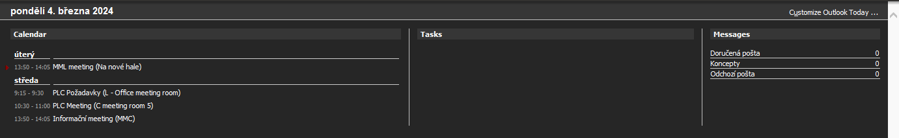

# Outlook Today: Black Edition
Black version of Outlook Today for Outlook

Microsoft probably forgor about existence of this thing, and the default white theme with the black theme of Office is kinda jarring. After a bit of shenanigoogles I found out how to change things up, and made this dark version of Outlook Today.

## Installation
1. Download [OutlookTodayDark.dll](https://github.com/Moravuscz/OutlookTodayBlackEdition/releases/latest/download/OutlookTodayDark.dll) and put it somewhere safe (e.g. `C:\Users\Documents\Outlook\OutlookTodayDark.dll`)  
2. In Outlook right-click clicking your mail name in the left sidebar  
3. Select `Data file properties` at the bottom of the context menu, a new window will apppear  
   
5. On the Home Page tab change the path to `res://<where you saved your OutlookTodayDark.dll\>/OUTLOOK.HTM`  
6. (e.g. `res://C:\Users\Documents\Outlook\OutlookTodayDark.dll/OUTLOOK.HTM`)  
**The `res://` at the beginning and `/OUTLOOK.HTM` after the .dll are important!**  
   
8. Restart Outlook
